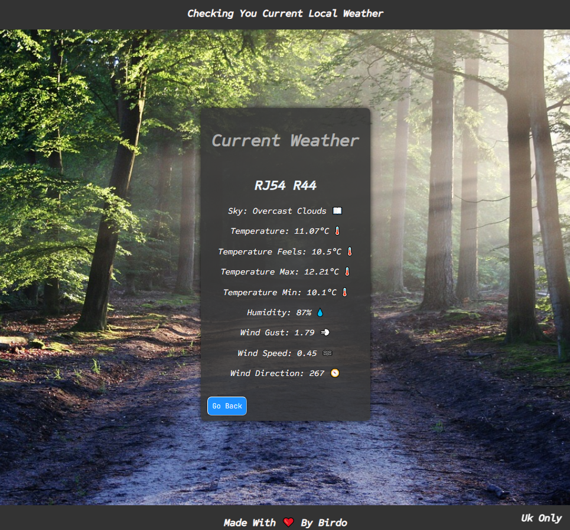
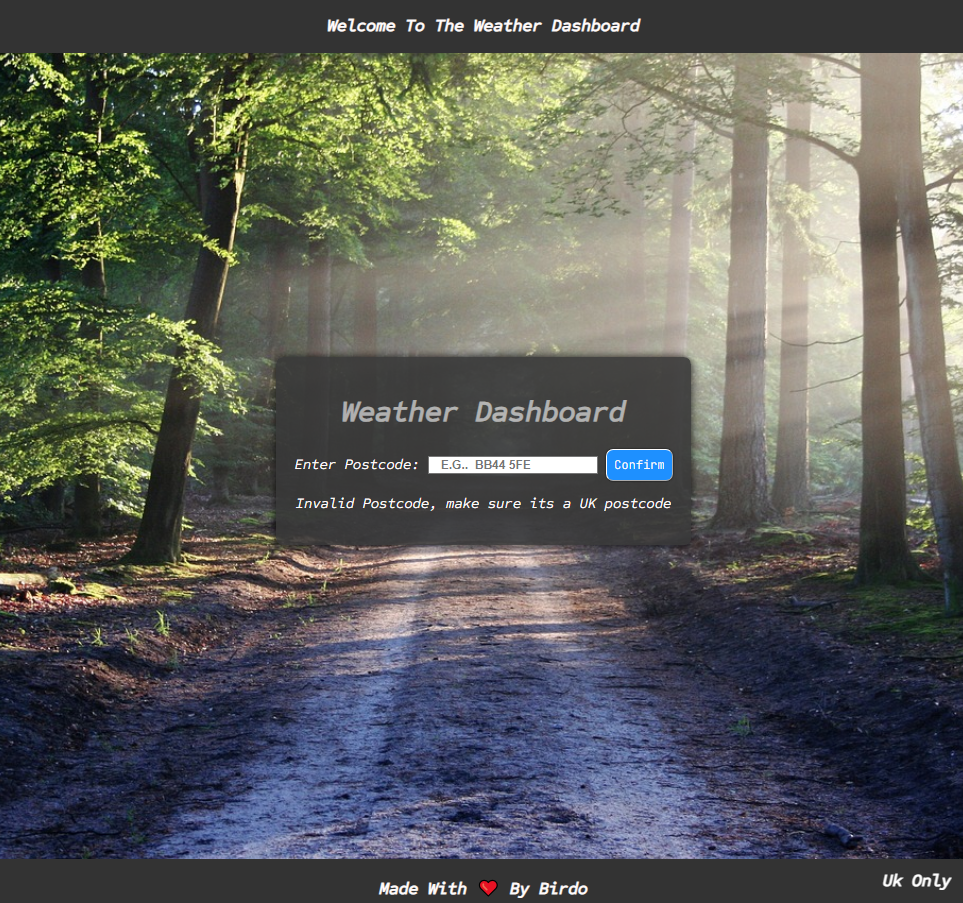

# Weather Dashboard

This Weather Dashboard is a web application built with Flask 
that allows users to check the current weather conditions by entering their postcode.
Its integrated with the OpenWeatherMap API to retrieve the real-time weather data.

## Features

- **Real-time Weather Data**: Retrieve current weather conditions by entering a postcode.
- **Detailed Weather Information**: Display temperature, humidity, pressure, wind speed, wind direction, and more.
- **Responsive Design**: Accessible on various devices and screen sizes.

## Screenshots



## Setup

1. **Clone the Repository:**

  ```
  git clone https://github.com/your_username/weather-dashboard.git
  ```
Install Dependencies:

  ```
  pip install -r requirements.txt
  ```





2. **Obtain OpenWeatherMap API Key:**

To Obtain an API key from OpenWeatherMap you just need to register an account.

You can also you another Weather Api but you will need to edit the data that is received from it, when you 
ask for the data the data response to *json.response* it displays the data its receives so you need to change
the values of the placeholders that will display the data for the expected data to show 

When you Obtain an API key from OpenWeatherMap or Another Api 
replace the string 'Your_WeatherMap_Api_Key' in app.py with your actual API key.

3. **Run the Application:**

  ```
  python app.py
  ```

4. **Access the Application:**

Open your web browser and navigate to 
```http://localhost:5000. ```

For Usage : 
Just enter the postcode of a desired location in the input field and 
you will retrieve the weather data from that desired location, it will 
display the retrieved data on the localhost webpage.
